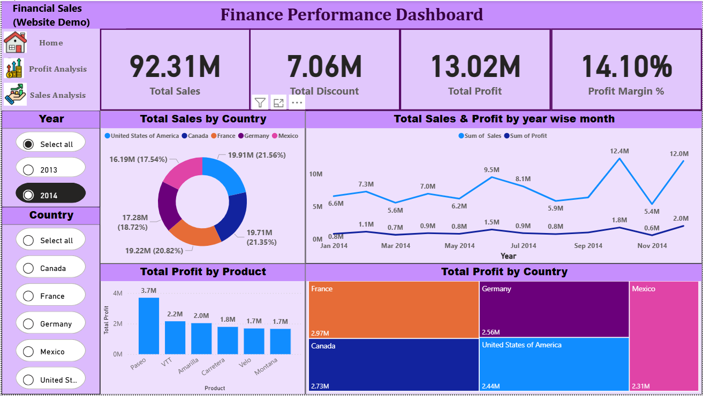

# 📊 Power BI Interactive Dashboard – Sales & Financial Analytics

## 🔍 Project Overview

This project presents a **professional interactive Power BI dashboard** created as part of my Data Analyst Internship – Task 3. The goal was to build a dynamic and visually compelling dashboard that allows business stakeholders to analyze sales, profit, cost, and growth metrics easily.

---

## 🎯 Objective

Design and deliver a CEO-ready dashboard to:
- Track key metrics (Sales, Profit, COGS)
- Identify regional and category trends
- Support strategic decisions with visuals
- Enable user-driven interactivity with filters and slicers

---

## 🧩 Dataset

- **Source**: Kaggle (Superstore / Sales dataset) or mock dataset
- **Fields Used**:
  - Date, Category, Sub-Category
  - Sales, Profit, Quantity, Discount, COGS
  - Region, Country, City

---

## 🛠️ Tools Used

| Tool        | Purpose                         |
|-------------|----------------------------------|
| Power BI    | Dashboard creation, visuals     |
| Power Query | Data transformation/cleaning    |
| DAX         | Calculated fields and KPIs      |
| Excel       | Dataset organization (optional) |
| GitHub      | Version control and submission  |

---

## 📈 Dashboard Features

### 💡 Key Metrics & Visuals
- **KPI Cards**: Sales, Profit, COGS, Profit Margin
- **Time Series Line Chart**: Monthly Sales Trends
- **Bar Charts**: Sales by Category & Region
- **Donut Chart**: Profit by Region
- **Map**: Sales by Country, State, City
- **Table**: Product-level data with conditional formatting

### 🔄 Interactivity
- **Slicers**: Category, Region, Date
- **Filters**: Year, Quarter, Country
- **Navigation Buttons** *(if multi-page)*

---

## 📊 Business Insights

- ✅ Region **X** showed highest profitability
- ⚠️ Category **Y** had high sales but poor margin
- 📉 Some regions suffer from high COGS – action needed
- 📈 Year-over-year growth detected in multiple areas

---

## 📁 Files in This Repo

| File Name              | Description                          |
|------------------------|--------------------------------------|
| `Task.pbix`       | Final Power BI dashboard             |
| `Superstore Dataset.xlsx` | Cleaned dataset used for analysis    |
| `Dashboard.png` | Dashboard image for preview     |
| `Summary.pptx`         | PowerPoint summary presentation      |
| `README.md`            | Project documentation (this file)    |

---

## 📄 License

This project is for learning and portfolio purposes only.  
No commercial use of the data or visuals is allowed.

---

## 🙋‍♂️ Author

**Rutikesh Pawar**  
Aspiring Data Analyst | Power BI Enthusiast  
[GitHub](https://github.com/rutikeshpawar) • [LinkedIn](https://linkedin.com/in/rutikeshpawar227)

---

